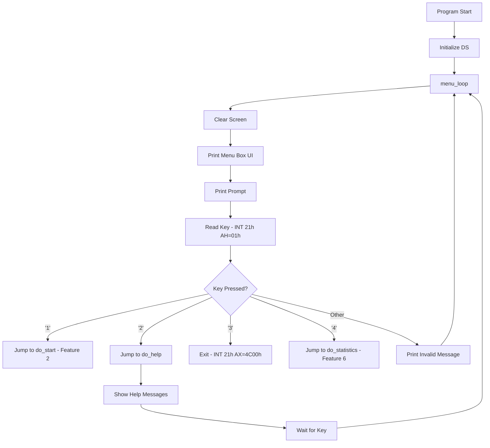
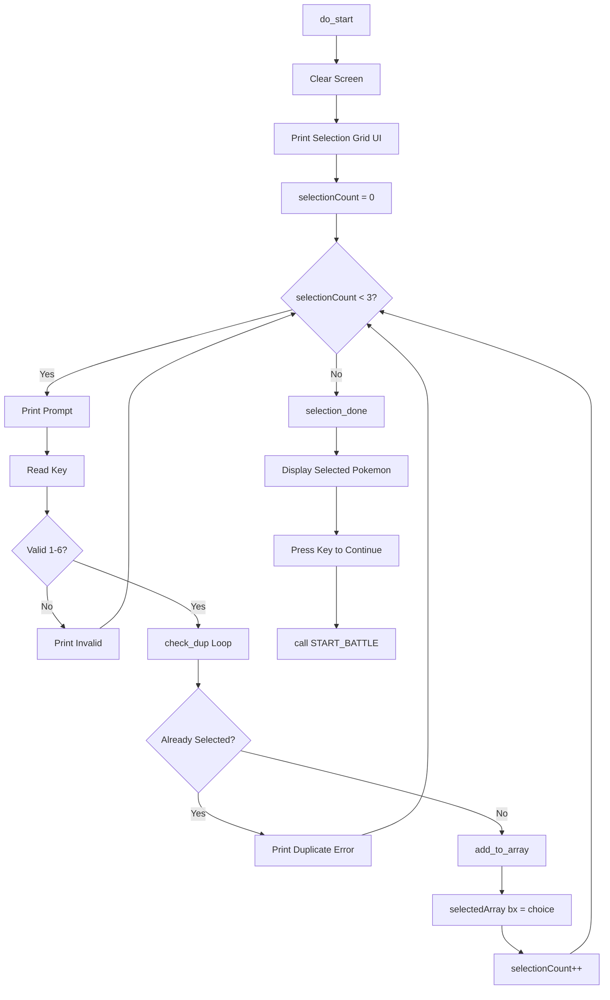
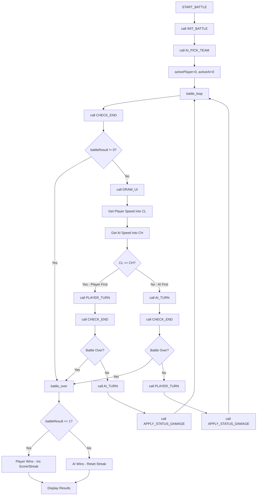
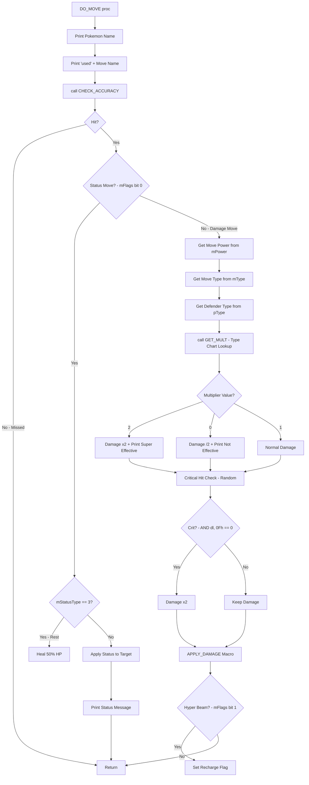
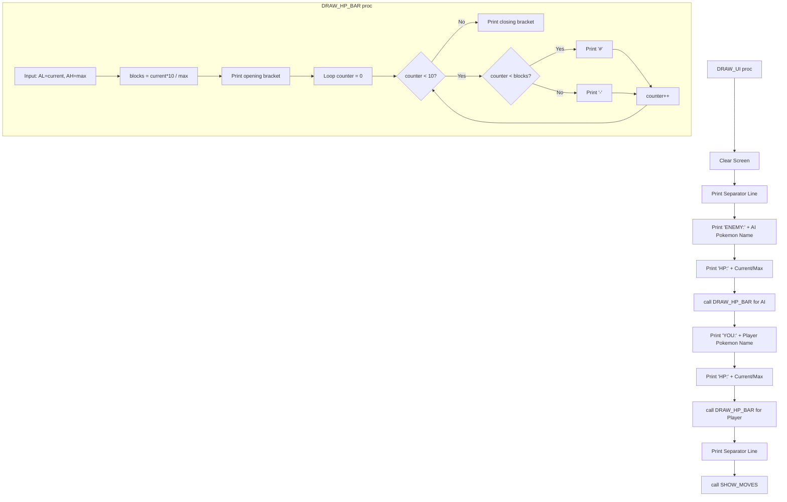

```mermaid
flowchart TD
    subgraph Statistics Screen [do_statistics Lines 553-692]
        A[do_statistics] --> B{roundCount == 0?}
        B -->|Yes| C[Print 'No battles played yet!']
        B -->|No| D[Print Stats Header]
        D --> E[Print Total Battles]
        E --> F[Print Player Score]
        F --> G[Print CPU Score]
        G --> H[Calculate Win Rate %]
        H --> I[Print Win Rate]
        I --> J[Print Best Streak]
        J --> K[Print Current Streak]
        K --> L[Wait for Key]
        L --> M{Key == 'R' or 'r'?}
        M -->|Yes| N[Reset All Stats to 0]
        M -->|No| O[Return to Menu]
        N --> O
        C --> L
    end
    
    subgraph CHECK_END [CHECK_END Lines 2088-2107]
        P[CHECK_END proc] --> Q[SUM_HP aiHP]
        Q --> R{Sum == 0?}
        R -->|Yes| S[battleResult = 1 - Player Wins]
        R -->|No| T[SUM_HP playerHP]
        T --> U{Sum == 0?}
        U -->|Yes| V[battleResult = 2 - AI Wins]
        U -->|No| W[battleResult = 0 - Continue]
    end
```

# 📘 PokeBattle 8086 - Complete Technical Documentation

> **File:** `PokeBattle8086.asm`  
> **Total Lines:** 2110  
> **Platform:** 8086 Assembly (EMU8086)

---

## 📋 Table of Contents
1. [Feature Line Ranges](#1-feature-line-ranges)
2. [Data Segment Variable Map](#2-data-segment-variable-map)
3. [Feature 1: Main Menu (Flowchart + Python)](#3-feature-1-main-menu--navigation)
4. [Feature 2: Pokemon Selection (Flowchart + Python)](#4-feature-2-pokemon-selection-system)
5. [Feature 3: Battle Engine (Flowchart + Python)](#5-feature-3-turn-based-battle-engine)
6. [Feature 4: Move System (Flowchart + Python)](#6-feature-4-move-system-with-type-effectiveness)
7. [Feature 5: Battle UI (Flowchart + Python)](#7-feature-5-battle-ui--hp-bar-animation)
8. [Feature 6: Victory/Stats (Flowchart + Python)](#8-feature-6-victorydefeat-system-with-score-tracking)

---

## 1. Feature Line Ranges

| Feature | Description | Line Range | Key Labels/Procedures | Student |
|:--------|:------------|:-----------|:----------------------|:--------|
| **Feature 1** | Main Menu & Navigation | **303 - 345** | `menu_loop`, `do_help`, `do_exit` | Shafi Ahmed Adib (23101307) |
| **Feature 2** | Pokemon Selection System | **348 - 511** | `do_start`, `select_loop`, `check_dup`, `add_to_array` | Shafi Ahmed Adib (23101307) |
| **Feature 3** | Turn-Based Battle Engine | **795 - 935** | `START_BATTLE`, `battle_loop`, `ai_first`, `battle_over` | Farhan Zarif (23301692) |
| **Feature 3** | Battle Support Procedures | **937 - 1347** | `INIT_BATTLE`, `AI_PICK_TEAM`, `CHECK_STATUS`, `APPLY_STATUS_DAMAGE` | Farhan Zarif (23301692) |
| **Feature 3** | Turn Execution | **1598 - 1796** | `PLAYER_TURN`, `AI_TURN` | Farhan Zarif (23301692) |
| **Feature 4** | Move System & Type Logic | **1798 - 2034** | `DO_MOVE`, `dm_dmg`, `dm_eff`, `dm_app` | Farhan Zarif (23301692) |
| **Feature 5** | Battle UI & HP Bars | **1349 - 1596** | `DRAW_HP_BAR`, `DRAW_UI`, `SHOW_MOVES` | Amrin Hoque Yeana (23301091) |
| **Feature 6** | Statistics Screen | **553 - 692** | `do_statistics`, `stats_show`, `stats_reset` | Amrin Hoque Yeana (23301091) |
| **Feature 6** | Victory Check Logic | **2088 - 2107** | `CHECK_END` | Amrin Hoque Yeana (23301091) |

---

## 2. Data Segment Variable Map

**Lines 13 - 199** contain all game data. Here is the mapping to Python equivalents:

| ASM Variable | Line | Python Equivalent | Description |
|:-------------|:-----|:------------------|:------------|
| `selectedArray db 3 dup(?)` | 42 | `selected_array = [0, 0, 0]` | Buffer for user's 3 selections |
| `selectionCount dw 0` | 43 | `selection_count = 0` | Counter during selection |
| `pNames dw pn0,pn1...` | 45 | `p_names = ["PIKACHU", ...]` | Pokemon name lookup table |
| `pType db 4,3,2,1,0,0` | 52 | `p_type = [4, 3, 2, 1, 0, 0]` | Type IDs: 0=Normal, 1=Water, 2=Fire, 3=Grass, 4=Electric |
| `pMaxHP db 35,45,39,44,40,60` | 53 | `p_max_hp = [35, 45, 39, 44, 40, 60]` | Base HP for each Pokemon |
| `pSpeed db 90,45,65,43,55,30` | 54 | `p_speed = [90, 45, 65, 43, 55, 30]` | Speed stat (determines turn order) |
| `playerTeam db 3 dup(0)` | 93 | `player_team = [0, 0, 0]` | Player's active team indices |
| `aiTeam db 3 dup(0)` | 94 | `ai_team = [0, 0, 0]` | AI's team indices |
| `playerHP db 3 dup(0)` | 95 | `player_hp = [0, 0, 0]` | Current HP for player's team |
| `aiHP db 3 dup(0)` | 96 | `ai_hp = [0, 0, 0]` | Current HP for AI's team |
| `activePlayer db 0` | 103 | `active_player = 0` | Index (0-2) of current Pokemon |
| `activeAI db 0` | 104 | `active_ai = 0` | Index (0-2) of AI's current Pokemon |
| `battleResult db 0` | 105 | `battle_result = 0` | 0=ongoing, 1=player win, 2=AI win |
| `effectMatrix db 1,1,1,1,1...` | 117-121 | `effect_matrix = [[1,1,1,1,1], ...]` | 5x5 Type effectiveness chart |
| `playerScore db 0` | 167 | `player_score = 0` | Total wins |
| `winStreak db 0` | 184 | `win_streak = 0` | Current consecutive wins |
| `bestStreak db 0` | 185 | `best_streak = 0` | All-time best streak |

---

## 3. Feature 1: Main Menu & Navigation

**Lines: 303 - 345** | **Student: Shafi Ahmed Adib (23101307)**

### Flowchart


### Python Equivalent
```python
# ASM Lines 303-345: menu_loop through do_exit
def main_menu():
    """
    Maps to: menu_loop (Line 303)
    ASM: Infinite loop with CMP/JE branching
    """
    while True:  # ASM: Label menu_loop creates infinite loop via JMP menu_loop (Line 345)
        clear_screen()  # ASM: call clrscr (Line 309)
        
        # ASM Lines 313-322: Print UI using PRINTLN macro
        print("==========================================")
        print("||           POKEBATTLE 8086            ||")
        print("==========================================")
        print("||             1. START                 ||")
        print("||             2. HELP                  ||")
        print("||             3. EXIT                  ||")
        print("||             4. STATS                 ||")
        print("==========================================")
        
        print("Enter choice (1-3):")  # ASM: LEA dx, prompt / INT 21h (Lines 324-326)
        
        # ASM Lines 328-329: INT 21h with AH=01h reads single character into AL
        choice = input()[0]
        
        # ASM Lines 331-338: CMP and JE instructions for branching
        if choice == '1':    # CMP al, '1' / JE do_start
            selection_screen()  # Feature 2
        elif choice == '2':  # CMP al, '2' / JE do_help
            show_help()
        elif choice == '3':  # CMP al, '3' / JE do_exit
            exit()           # ASM: MOV ax, 4C00h / INT 21h (Lines 549-550)
        elif choice == '4':  # CMP al, '4' / JE do_statistics
            show_statistics()  # Feature 6
        else:
            print("Invalid choice, try again.")  # ASM: Lines 340-344
            # Loop continues via JMP menu_loop (Line 345)
```

---

## 4. Feature 2: Pokemon Selection System

**Lines: 348 - 511** | **Student: Shafi Ahmed Adib (23101307)**

### Flowchart


### Python Equivalent
```python
# ASM Lines 348-511: do_start through back_to_menu
def selection_screen():
    """
    Maps to: do_start (Line 348), select_loop (Line 371), check_dup (Line 391)
    """
    global selected_array, selection_count
    
    clear_screen()  # ASM: call clrscr (Lines 353-354)
    
    # ASM Lines 357-363: Print 2-column grid
    print("==========================================")
    print("||           SELECT 3 POKEMON           ||")
    print("==========================================")
    print("||  1) Pikachu        2) Bulbasaur      ||")
    print("||  3) Charmander     4) Squirtle       ||")
    print("||  5) Eevee          6) Snorlax        ||")
    print("==========================================")
    
    selection_count = 0  # ASM: MOV selectionCount, 0 (Line 369)
    
    # ASM Lines 371-407: select_loop
    while selection_count < 3:  # ASM: CMP selectionCount, 3 / JE selection_done (Lines 372-373)
        print("Enter Pokemon number (1-6):")
        choice = input()[0]  # ASM: INT 21h AH=01h (Lines 380-381)
        
        # ASM Lines 383-386: Range validation
        if choice < '1' or choice > '6':  # CMP al, '1' / JL ... / CMP al, '6' / JG
            print("Invalid choice, try again.")  # ASM: invalid_input (Lines 409-414)
            continue
        
        # ASM Lines 391-401: check_dup loop
        is_duplicate = False
        for i in range(selection_count):  # ASM: BX=0, CX=0, then INC BX/INC CX
            if selected_array[i] == choice:  # ASM: MOV dl, selectedArray[bx] / CMP dl, al
                is_duplicate = True
                break
        
        if is_duplicate:
            print("You cannot select one pokemon twice")  # ASM: duplicate_error (Lines 416-421)
            continue
        
        # ASM Lines 403-407: add_to_array
        selected_array[selection_count] = choice  # ASM: MOV selectedArray[bx], al (Line 405)
        selection_count += 1  # ASM: INC selectionCount (Line 406)
    
    # ASM Lines 423-510: selection_done and display_selected
    print("Your selected Pokemons:")
    for i in range(3):
        idx = int(selected_array[i]) - ord('1')  # ASM: SUB al, 30h (Line 439)
        print(p_names[idx])
    
    input("Press any button to Continue...")  # ASM: Lines 504-509
    start_battle()  # ASM: call START_BATTLE (Line 510)
```

---

## 5. Feature 3: Turn-Based Battle Engine

**Lines: 795 - 935, 937-1347, 1598-1796** | **Student: Farhan Zarif (23301692)**

### Flowchart


### Python Equivalent
```python
# ASM Lines 795-935: START_BATTLE proc
def start_battle():
    """
    Maps to: START_BATTLE (Line 795), battle_loop (Line 805)
    """
    global active_player, active_ai, battle_result
    global player_score, ai_score, round_count, win_streak, best_streak
    
    init_battle()      # ASM: call INIT_BATTLE (Line 800)
    ai_pick_team()     # ASM: call AI_PICK_TEAM (Line 801)
    
    active_player = 0  # ASM: MOV activePlayer, 0 (Line 802)
    active_ai = 0      # ASM: MOV activeAI, 0 (Line 803)
    battle_result = 0  # ASM: MOV battleResult, 0 (Line 804)
    
    # ASM Lines 805-858: battle_loop
    while True:
        check_end()  # ASM: call CHECK_END (Line 806)
        
        if battle_result != 0:  # ASM: CMP battleResult, 0 / JNE battle_over (Lines 807-808)
            break
        
        draw_ui()  # ASM: call DRAW_UI (Line 809)
        
        # ASM Lines 810-821: Speed comparison for turn order
        player_poke_idx = player_team[active_player]
        ai_poke_idx = ai_team[active_ai]
        player_speed = p_speed[player_poke_idx]  # ASM: MOV cl, pSpeed[bx] (Line 815)
        ai_speed = p_speed[ai_poke_idx]          # ASM: MOV ch, pSpeed[bx] (Line 821)
        
        # ASM Lines 822-823: CMP cl, ch / JB ai_first
        if player_speed >= ai_speed:
            # Player goes first (Lines 824-838)
            player_turn()  # ASM: call PLAYER_TURN (Line 827)
            check_end()
            if battle_result != 0:
                break
            ai_turn()      # ASM: call AI_TURN (Line 835)
            apply_status_damage()  # ASM: call APPLY_STATUS_DAMAGE (Line 836)
        else:
            # AI goes first (Lines 843-858)
            ai_turn()
            check_end()
            if battle_result != 0:
                break
            draw_ui()
            player_turn()
            apply_status_damage()
    
    # ASM Lines 860-934: battle_over
    clear_screen()
    
    if battle_result == 1:  # ASM: CMP battleResult, 1 (Line 867)
        # Player wins
        player_score += 1   # ASM: INC playerScore (Line 870)
        round_count += 1    # ASM: INC roundCount (Line 871)
        win_streak += 1     # ASM: INC winStreak (Line 872)
        
        # ASM Lines 874-877: Update best streak
        if win_streak > best_streak:
            best_streak = win_streak
        
        print("YOU WIN!")   # ASM: LEA dx, strWin (Line 880)
    else:
        # AI wins
        ai_score += 1       # ASM: INC aiScore (Line 884)
        round_count += 1
        win_streak = 0      # ASM: MOV winStreak, 0 (Line 886)
        print("YOU LOSE!")  # ASM: LEA dx, strLose (Line 887)
    
    print(f"ROUND: {round_count}")
    print(f"SCORE -> YOU: {player_score}  CPU: {ai_score}")
```

---

## 6. Feature 4: Move System with Type Effectiveness

**Lines: 1798 - 2034** | **Student: Farhan Zarif (23301692)**

### Flowchart


### Python Equivalent
```python
# ASM Lines 1798-2034: DO_MOVE proc
def do_move(move_idx, is_ai):
    """
    Maps to: DO_MOVE (Line 1798)
    Input: AL = move index (0-3), AH = 0 for player, 1 for AI
    
    ASM uses SI register to preserve AX throughout the procedure
    """
    global player_hp, ai_hp, player_status, ai_status
    
    # ASM Lines 1808-1818: Print "[Pokemon] used [Move]"
    if not is_ai:
        attacker_poke = player_team[active_player]  # ASM: LOAD_ARR playerTeam, activePlayer
    else:
        attacker_poke = ai_team[active_ai]          # ASM: LOAD_ARR aiTeam, activeAI
    
    print(f"{p_names[attacker_poke]} used ", end="")
    
    # ASM Lines 1827-1838: Calculate global move index
    global_move_idx = attacker_poke * 4 + move_idx  # ASM: MUL cl (4) / ADD bx, ax
    print(m_names[global_move_idx])
    
    # ASM Lines 1841-1843: Accuracy check
    if not check_accuracy(global_move_idx):  # ASM: call CHECK_ACCURACY
        return  # Move missed
    
    # ASM Lines 1845-1847: Check if status move
    if m_flags[global_move_idx] & 0x01:  # ASM: TEST al, 01h / JZ dm_dmg
        status_type = m_status_type[global_move_idx]
        
        if status_type == 3:  # ASM: CMP al, 3 / JE dm_rest
            # REST move - heal and sleep
            if not is_ai:
                heal = player_max_hp[active_player] // 2
                player_hp[active_player] = min(player_hp[active_player] + heal, 
                                                player_max_hp[active_player])
                player_status[active_player] = 3  # Sleep
            print("restored HP!")
        else:
            # Apply status to opponent
            if not is_ai:
                target_idx = active_ai
                ai_status[target_idx] = status_type
                ai_status_turns[target_idx] = 3
            else:
                target_idx = active_player
                player_status[target_idx] = status_type
            
            # ASM Lines 1879-1894: Print status message
            status_messages = {1: "is paralyzed!", 2: "fell asleep!", 
                               4: "is poisoned!", 5: "is burned!"}
            print(status_messages.get(status_type, ""))
        return
    
    # ASM Lines 1936-1988: Damage calculation
    power = m_power[global_move_idx]      # ASM: MOV dl, mPower[bx] (Line 1938)
    move_type = m_type[global_move_idx]   # ASM: MOV dh, mType[bx] (Line 1939)
    
    # Get defender type
    if not is_ai:
        defender_poke = ai_team[active_ai]
    else:
        defender_poke = player_team[active_player]
    defender_type = p_type[defender_poke]  # ASM: MOV cl, pType[bx] (Lines 1948/1957)
    
    # ASM Lines 1959-1963: Type effectiveness lookup
    # Formula: effectMatrix[move_type * 5 + defender_type]
    multiplier = effect_matrix[move_type * 5 + defender_type]  # ASM: call GET_MULT
    
    damage = power
    
    # ASM Lines 1967-1988: Apply multiplier
    if multiplier == 2:          # ASM: CMP ch, 2 / JNE dm_n2
        damage *= 2              # ASM: ADD al, al (Line 1969)
        print("Super effective!")  # ASM: LEA dx, strSuper
    elif multiplier == 0:        # ASM: CMP ch, 0 / JNE dm_app
        damage //= 2             # ASM: SHR al, 1 (Line 1979)
        if damage == 0:
            damage = 1           # ASM: MOV al, 1 (Line 1982)
        print("Not effective...")  # ASM: LEA dx, strWeak
    
    # ASM Lines 1990-2001: Critical hit check (6.25% chance)
    import random
    if random.randint(0, 15) == 0:  # ASM: AND dl, 0Fh / JNZ no_crit
        damage *= 2                  # ASM: SHL al, 1 (Line 1996)
        print("A critical hit!")     # ASM: PRINTLN strCritical
    
    # ASM Lines 2004-2010: Apply damage
    if not is_ai:
        ai_hp[active_ai] -= damage
        print(f"{damage} damage!")
        if ai_hp[active_ai] <= 0:
            ai_hp[active_ai] = 0
            ai_faint()               # ASM: call AI_FAINT
    else:
        player_hp[active_player] -= damage
        if player_hp[active_player] <= 0:
            player_hp[active_player] = 0
            player_faint()
    
    # ASM Lines 2011-2026: Hyper Beam recharge
    if m_flags[global_move_idx] & 0x02:  # ASM: TEST al, 02h
        if not is_ai:
            player_recharge[active_player] = 1
        else:
            ai_recharge[active_ai] = 1
```

---

## 7. Feature 5: Battle UI & HP Bar Animation

**Lines: 1349 - 1596** | **Student: Amrin Hoque Yeana (23301091)**

### Flowchart


### Python Equivalent
```python
# ASM Lines 1349-1405: DRAW_HP_BAR proc
def draw_hp_bar(current_hp, max_hp):
    """
    Maps to: DRAW_HP_BAR (Line 1349)
    Input: AL = current HP, AH = max HP
    Output: Prints [##########] style bar
    """
    # ASM Lines 1358-1360: Safety check for division by zero
    if max_hp == 0:
        max_hp = 1
    
    # ASM Lines 1363-1368: Calculate filled blocks
    # Formula: (current * 10) / max
    blocks = (current_hp * 10) // max_hp  # ASM: MUL cl (10) / DIV cl (max)
    
    # ASM Line 1373-1374: Print opening bracket
    bar = '['
    
    # ASM Lines 1376-1394: bar_loop
    for i in range(10):  # ASM: CMP ch, 10 / JGE bar_done
        if i < blocks:   # ASM: CMP ch, cl / JGE bar_empty
            bar += '#'   # ASM: MOV dl, '#' (Line 1384)
        else:
            bar += '-'   # ASM: MOV dl, '-' (Line 1389)
    
    # ASM Lines 1396-1398: Print closing bracket
    bar += ']'
    print(bar, end='')


# ASM Lines 1409-1471: DRAW_UI proc
def draw_ui():
    """
    Maps to: DRAW_UI (Line 1409)
    Renders the complete battle screen
    """
    clear_screen()  # ASM: call clrscr (Line 1414)
    
    print("==========================================")  # ASM: PRINTLN strLine
    
    # ASM Lines 1417-1420: Enemy display
    ai_poke_idx = ai_team[active_ai]  # ASM: LOAD_ARR aiTeam, activeAI
    print(f" ENEMY: {p_names[ai_poke_idx]}")
    
    # ASM Lines 1422-1441: Enemy HP bar
    current = ai_hp[active_ai]      # ASM: LOAD_ARR aiHP, activeAI
    maximum = ai_max_hp[active_ai]  # ASM: LOAD_ARR aiMaxHP, activeAI
    print(f" HP:{current}/{maximum} ", end="")
    draw_hp_bar(current, maximum)   # ASM: call DRAW_HP_BAR (Line 1439)
    print()
    print()
    
    # ASM Lines 1443-1466: Player display
    player_poke_idx = player_team[active_player]
    print(f" YOU:   {p_names[player_poke_idx]}")
    
    current = player_hp[active_player]
    maximum = player_max_hp[active_player]
    print(f" HP:{current}/{maximum} ", end="")
    draw_hp_bar(current, maximum)   # ASM: call DRAW_HP_BAR (Line 1465)
    print()
    
    print("==========================================")
    show_moves()  # ASM: call SHOW_MOVES (Line 1469)


# ASM Lines 1476-1596: SHOW_MOVES proc
def show_moves():
    """
    Maps to: SHOW_MOVES (Line 1476)
    Displays the 4 moves + Heal + Switch options
    """
    poke_idx = player_team[active_player]
    base_move = poke_idx * 4  # ASM: MUL cl (4) - Each pokemon has 4 moves
    pp_base = active_player * 4
    
    # ASM Lines 1496-1537: Print 4 moves with PP
    for i in range(4):  # ASM: sm_loop_new
        move_idx = base_move + i
        pp = player_pp[pp_base + i]
        print(f"{i+1}) {m_names[move_idx]} [PP:{pp}]")
    
    # ASM Lines 1539-1571: Heal option
    if player_item_used[active_player]:
        print("5) Heal (X)")  # Already used
    else:
        print("5) Heal")
    
    # ASM Lines 1573-1593: Switch option
    print("6) Switch")
    print("==========================================")
```

---

## 8. Feature 6: Victory/Defeat System with Score Tracking

**Lines: 553 - 692, 2088 - 2107** | **Student: Amrin Hoque Yeana (23301091)**

### Flowchart


### Python Equivalent
```python
# ASM Lines 553-692: do_statistics
def show_statistics():
    """
    Maps to: do_statistics (Line 553)
    Displays tournament statistics and allows reset
    """
    global player_score, ai_score, round_count, win_streak, best_streak
    
    clear_screen()
    
    # ASM Lines 562-564: Check if any battles played
    if round_count == 0:  # ASM: MOV al, roundCount / CMP al, 0 / JNE stats_show
        print("No battles played yet!")
    else:
        # ASM Lines 573-670: stats_show
        print("==========================================")
        print("How to Play:")  # Reuses helpMsg
        print("==========================================")
        print()
        
        print(f"Total Battles: {round_count}")   # ASM: Lines 591-596
        print(f"SCORE -> YOU: {player_score}")   # ASM: Lines 598-603
        print(f"CPU: {ai_score}")                # ASM: Lines 605-610
        print()
        
        # ASM Lines 617-640: Win rate calculation
        # Formula: (playerScore * 100) / roundCount
        if round_count > 0:
            # ASM: MOV al, playerScore / MOV cl, 100 / MUL cl / DIV bx
            win_rate = (player_score * 100) // round_count
            if win_rate > 100:  # ASM: CMP al, 100 / JBE rate_ok
                win_rate = 100
        else:
            win_rate = 0
        print(f"Win Rate: {win_rate}%")
        
        print(f"Best Streak: {best_streak}")      # ASM: Lines 652-657
        print(f"Current Streak: {win_streak}")    # ASM: Lines 659-664
        print()
        print("==========================================")
    
    # ASM Lines 672-692: Wait for input
    print("Press R to reset stats, any key to continue...")
    key = input()
    
    if key.upper() == 'R':  # ASM: CMP al, 'R' / JE stats_reset (Lines 680-683)
        # ASM Lines 686-691: stats_reset
        player_score = 0    # ASM: MOV playerScore, 0
        ai_score = 0        # ASM: MOV aiScore, 0
        round_count = 0     # ASM: MOV roundCount, 0
        win_streak = 0      # ASM: MOV winStreak, 0
        best_streak = 0     # ASM: MOV bestStreak, 0


# ASM Lines 2088-2107: CHECK_END proc
def check_end():
    """
    Maps to: CHECK_END (Line 2088)
    Uses SUM_HP macro to check if either team is wiped out
    """
    global battle_result
    
    # ASM Lines 2092-2096: Check AI team HP
    # SUM_HP macro: loops through 3 slots, adds HP values
    ai_total = sum(ai_hp)  # ASM: SUM_HP aiHP (Line 2092)
    
    if ai_total == 0:  # ASM: CMP al, 0 / JNE ce2 (Lines 2093-2094)
        battle_result = 1  # Player wins - ASM: MOV battleResult, 1 (Line 2095)
        return
    
    # ASM Lines 2097-2101: Check Player team HP
    player_total = sum(player_hp)  # ASM: SUM_HP playerHP (Line 2098)
    
    if player_total == 0:  # ASM: CMP al, 0 / JNE ce_d (Lines 2099-2100)
        battle_result = 2  # AI wins - ASM: MOV battleResult, 2 (Line 2101)
```

---

## 📝 Assembly to Python Mapping Reference

| ASM Construct | Python Equivalent | Example |
|:--------------|:------------------|:--------|
| `label:` + `JMP label` | `while True:` | `menu_loop:` → `while True:` |
| `CMP al, value` + `JE label` | `if var == value:` | `CMP al, '1' / JE do_start` → `if choice == '1':` |
| `CMP a, b` + `JL/JG/JLE` | `if a < b:` / `if a > b:` | `CMP cl, ch / JB ai_first` → `if speed < ai_speed:` |
| `INC variable` | `variable += 1` | `INC playerScore` → `player_score += 1` |
| `MOV dest, src` | `dest = src` | `MOV activePlayer, 0` → `active_player = 0` |
| `CALL procedure` | `function()` | `call DRAW_UI` → `draw_ui()` |
| `INT 21h AH=01h` | `input()[0]` | Single character input |
| `INT 21h AH=09h` | `print(string)` | String output |
| `MUL cl` | `result = al * cl` | `MUL cl` → `result = al * 4` |
| `DIV cl` | `al = result // cl` | Division with remainder in AH |
| `SHL al, 1` | `al *= 2` | Left shift = multiply by 2 |
| `SHR al, 1` | `al //= 2` | Right shift = divide by 2 |
| `AND al, mask` | `al & mask` | Bitwise AND for flags |
| `TEST al, bit` | `if al & bit:` | Flag checking |
| `LOOP label` | `for i in range(cx):` | CX-controlled loop |
| `arr[bx]` | `arr[idx]` | Array indexing |
